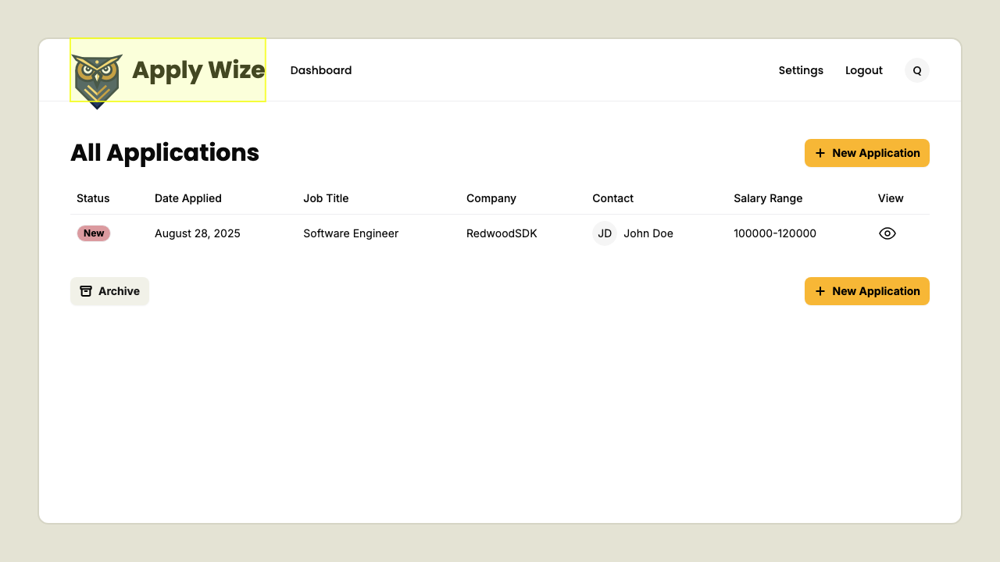
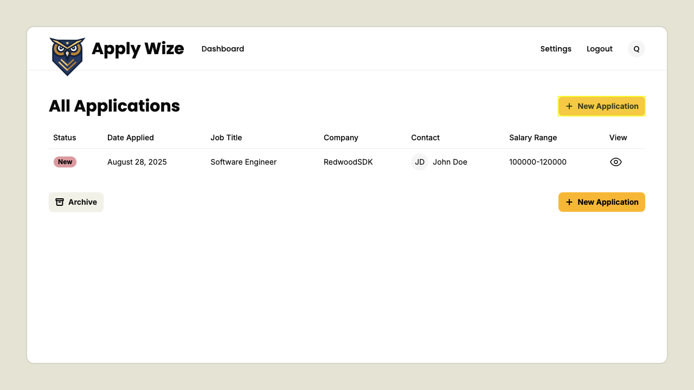
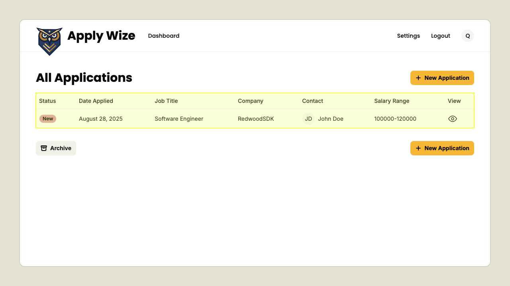
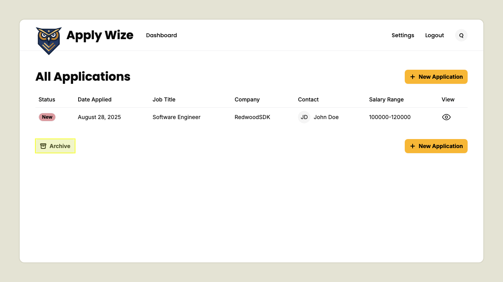
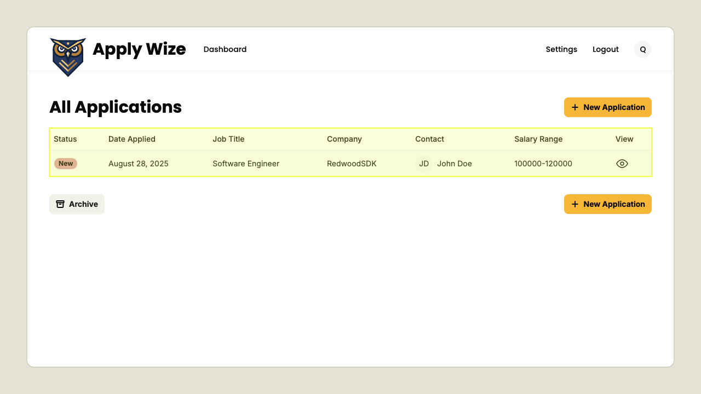

# Applications Page Navigation

## logo should redirect to home page

Navigate to applications page
Click on logo

Verify navigation to home page

## new application button navigates to the new application page

Navigate to applications page
Click on new application button

Verify navigation to new application page

## filter between active and archived applications

Navigate to applications page.
The table should populate with active applications.

Click on archived applications filter button.

Now archived applications should be displayed. If you haven't already archived an application the table won't appear.

Click on active applications filter button will return back to active applications.

Now active applications should be displayed again.

## How to logout

While on the applications page.
Click on logout button.

Now you should be logged out and on the login page.

To confirm that you are logged out if you try to go back to the applications page (/applications) it will redirect to login.

