# Applications Dashboard

## Logo should redirect to home page

While on the applications page, 
when the logo is clicked.
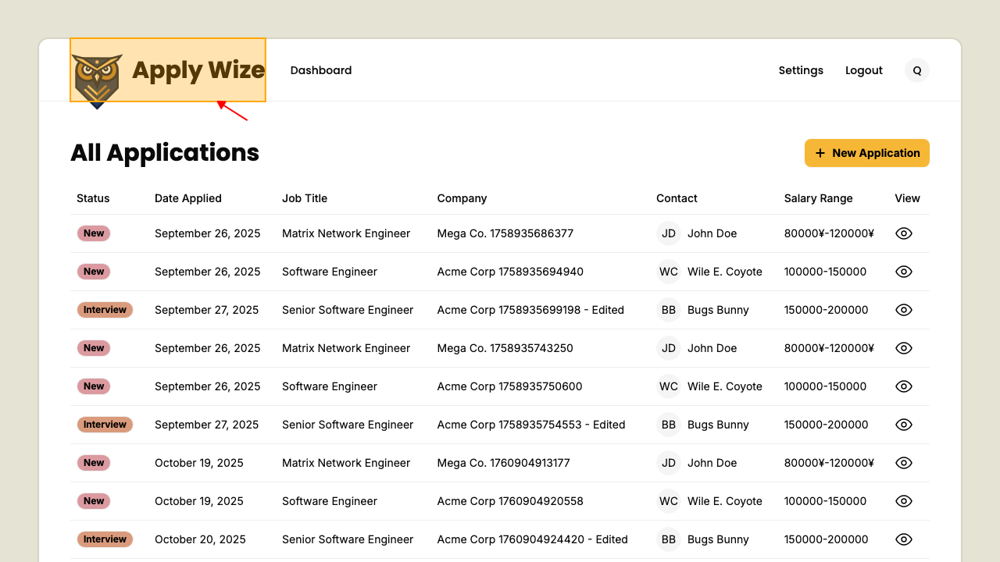
It should navigate to home page.

## View the details of an Application

Click on the view detail icon to open the view detail page
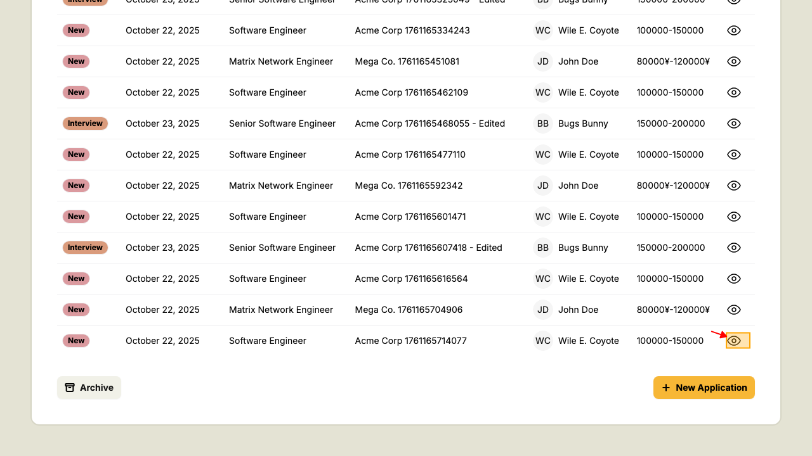
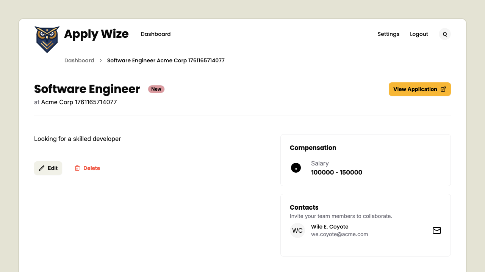
#### Elements on the details page
              ##### Job Title
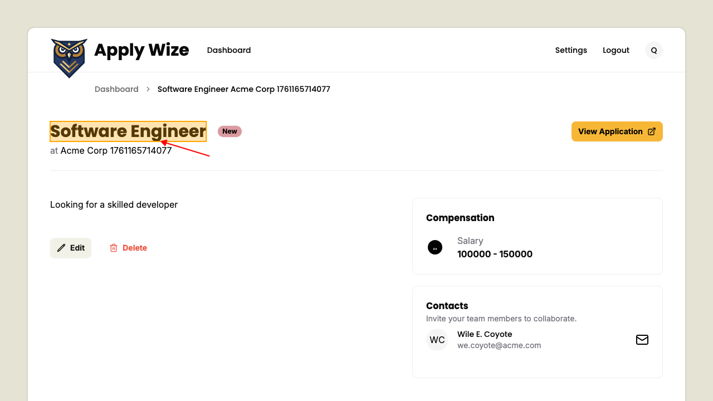
##### Application Status
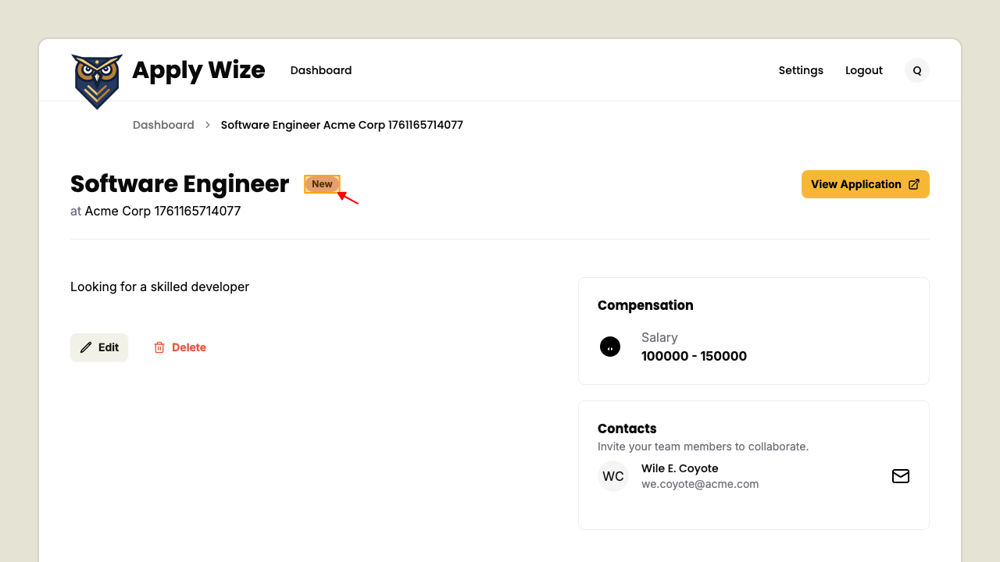
##### Link to the job application website

##### Job Description
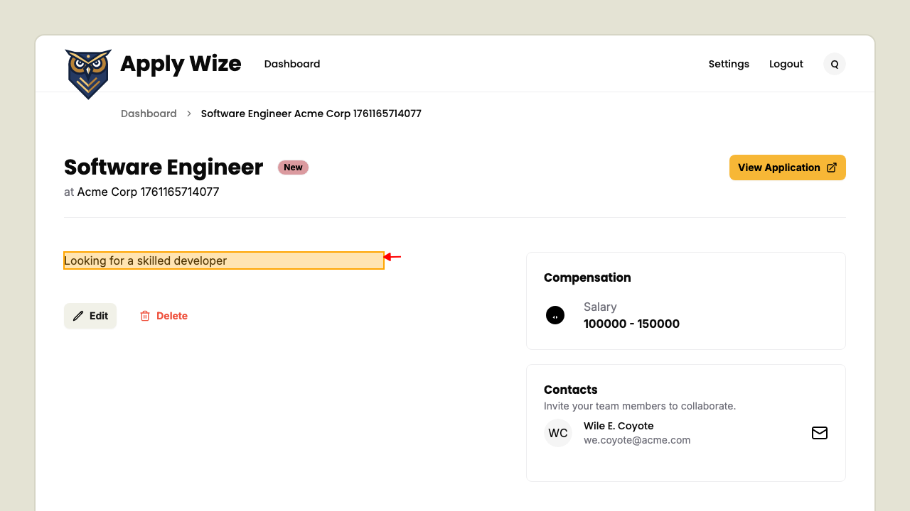
##### Compensation
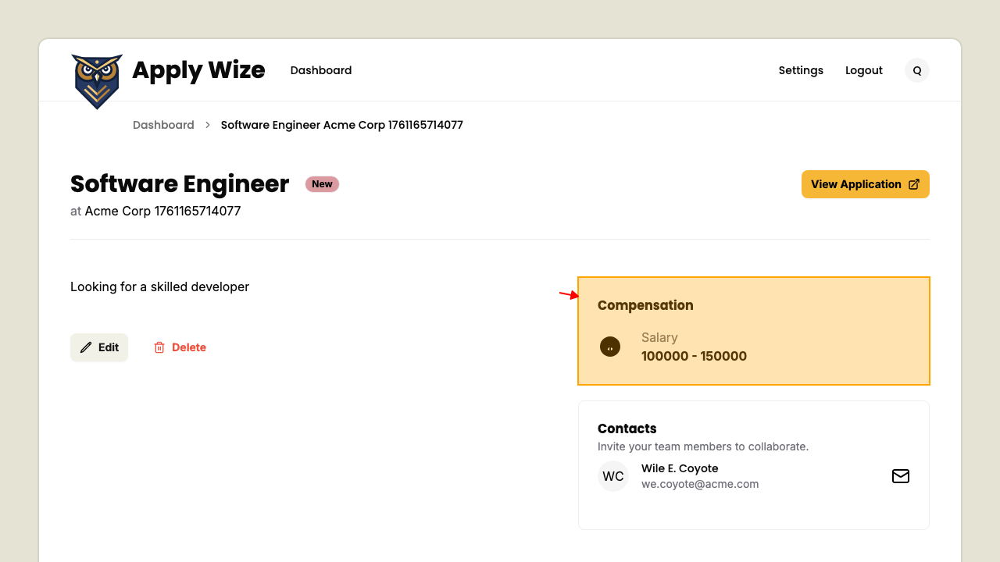
##### Contacts
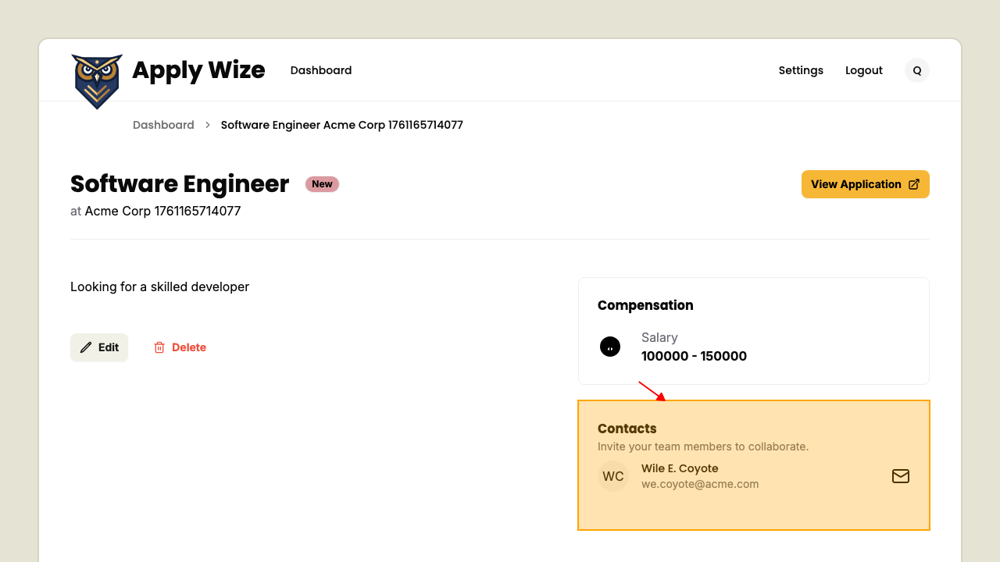
##### Edit Application button
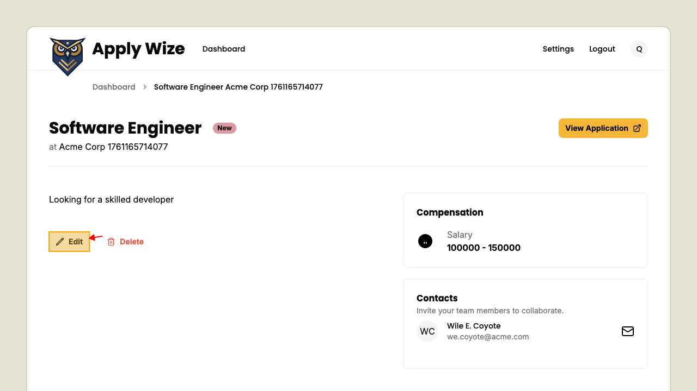
##### Delete Applications button
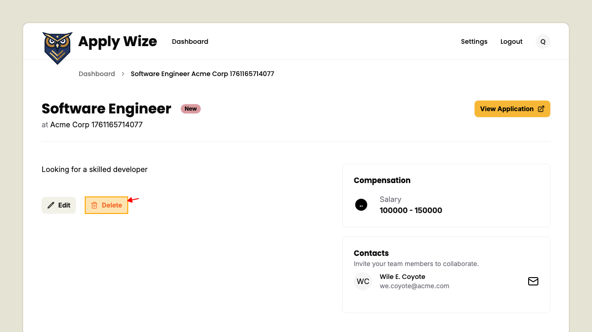

## Filter between active and archived applications

Navigate to applications page.
The table should populate with active applications.
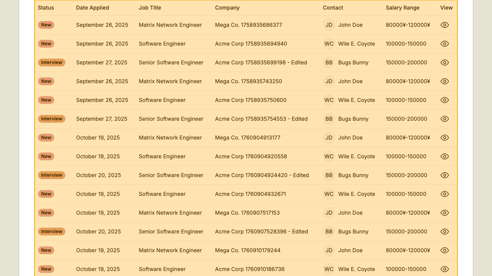
Click on archived applications filter button.
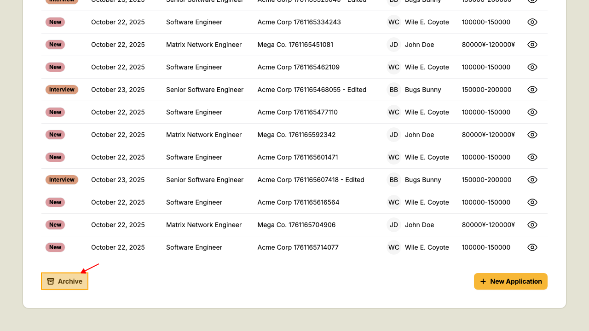
Now archived applications should be displayed. If you haven't already archived an application the table won't appear.
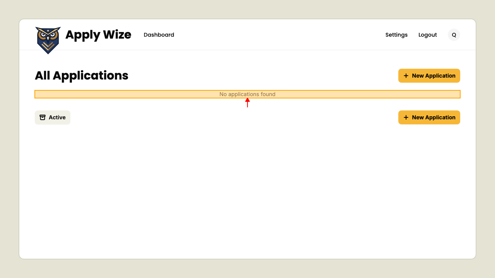
Click on active applications filter button will return back to active applications.
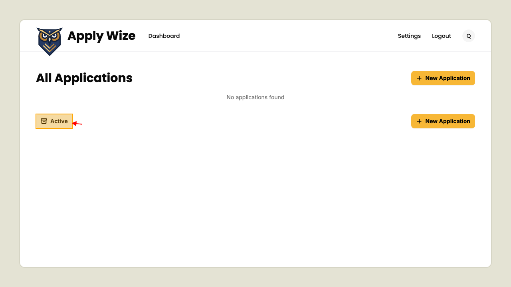
Now active applications should be displayed again.
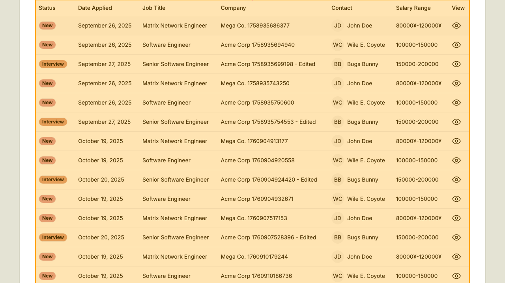

