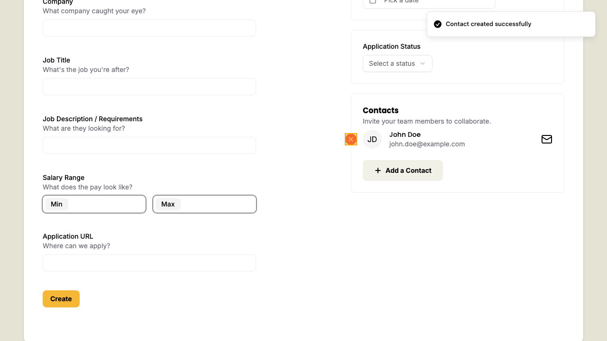
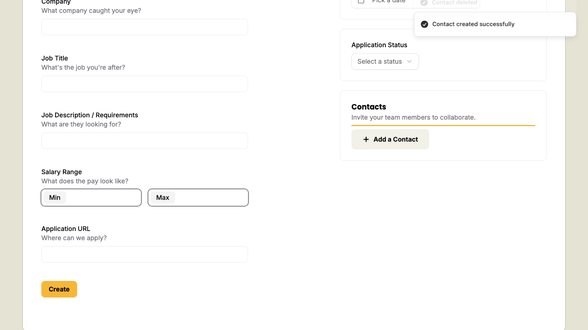

# Removing a contact from a new application

## Removing a contact from a new application

While on the new applications page if you've already added a contact

Hover over the contact card to make the delete button appear

clicking the delete button will remove the contact from the application

