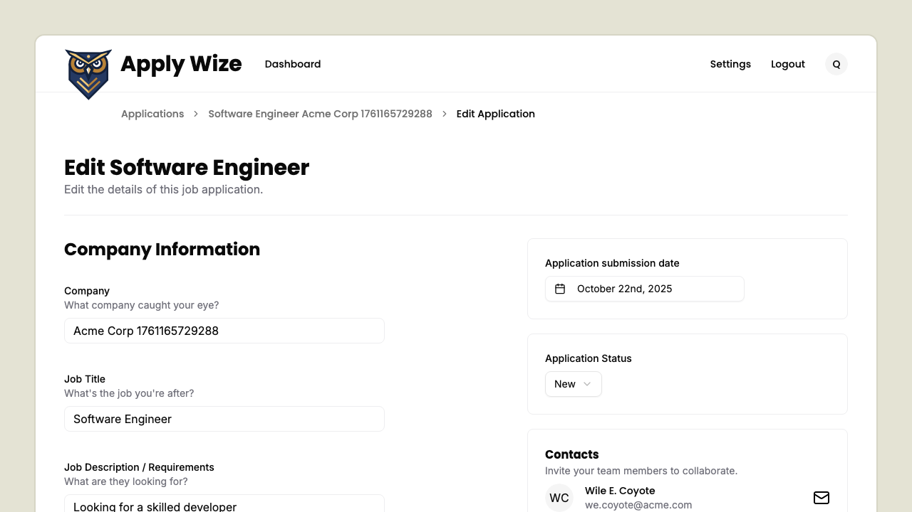
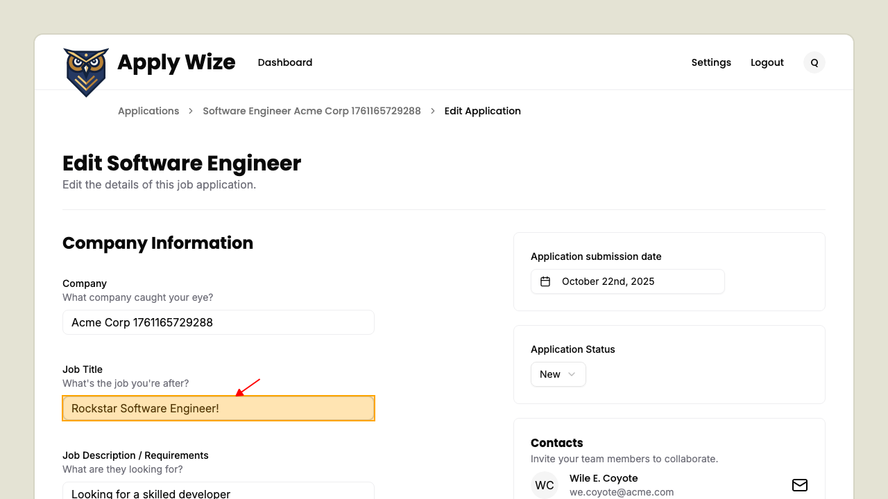
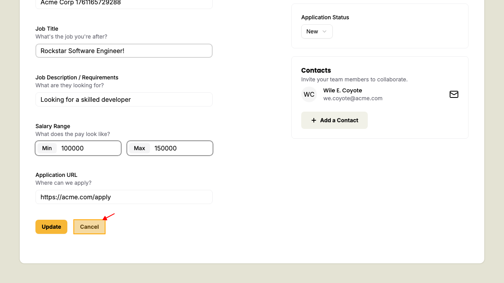
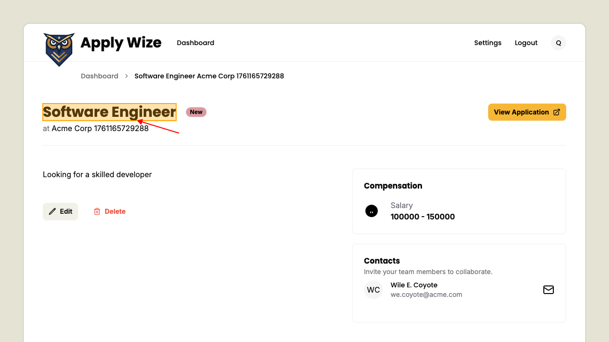

# Cancel an existing application

## To cancel an in-progress application

On the application's detail edit page.

If you make a change to one of the fields in the form.

And decide to cancel the edit, you can by clicking the cancel button.

You should be redirected back to the application detail page and your changes will not be saved.

