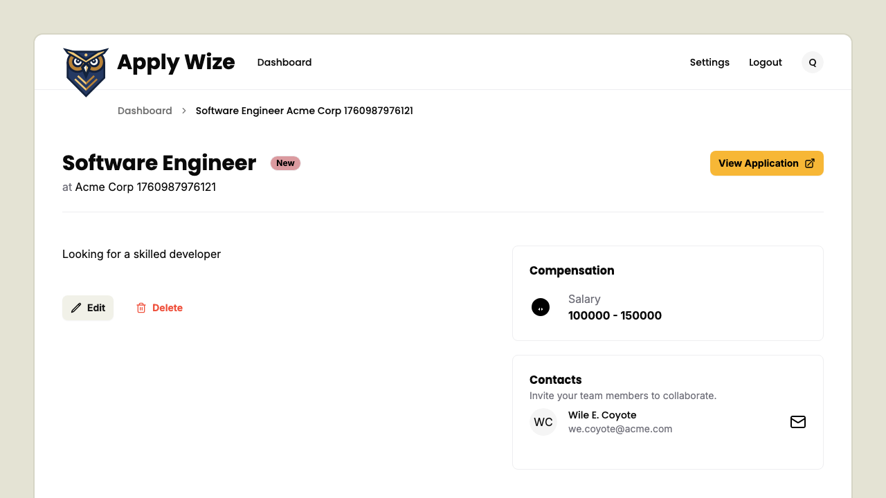
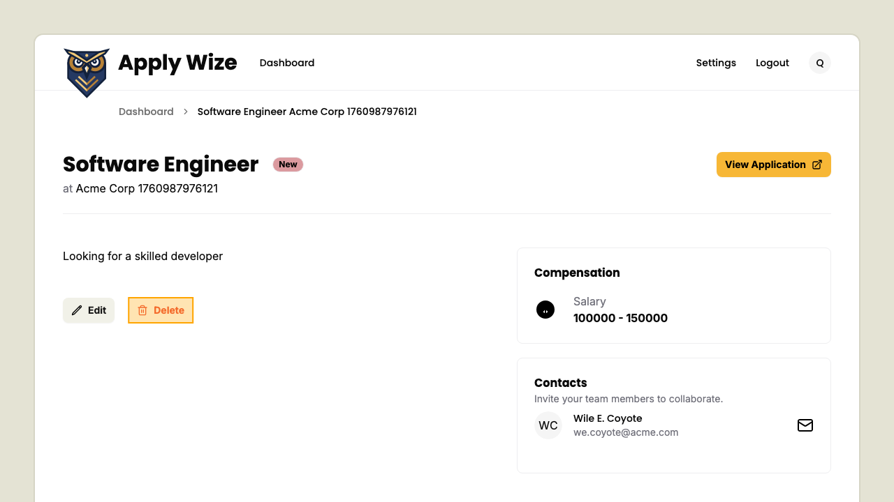
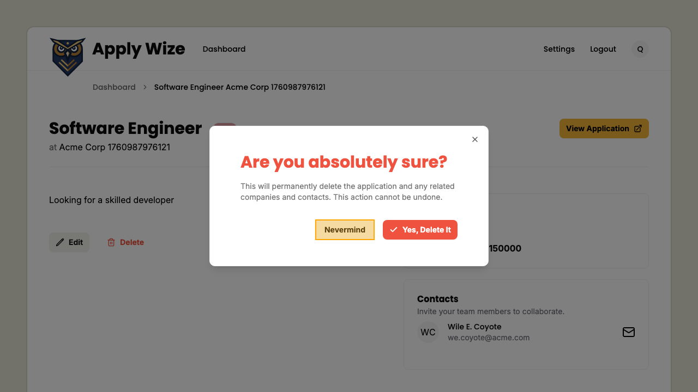
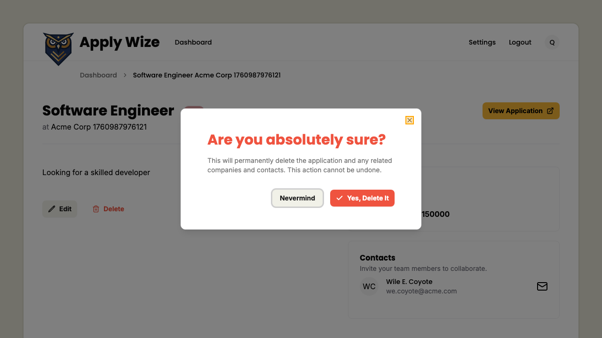
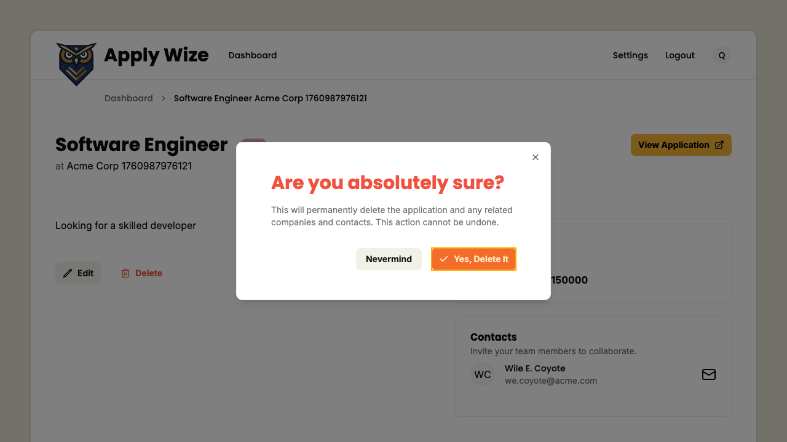
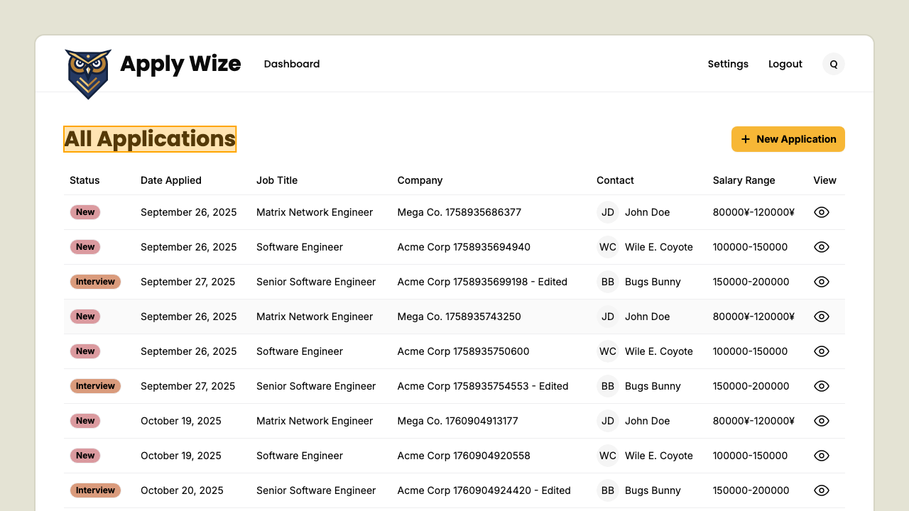

# Delete an application

## To delete an application

While on an application's detail page

Click on the delete button to open the delete confirmation dialog.

##### To dismiss the dialog
                ###### Click on the Nevermind button

###### Click outside of the dialog
###### Press the escape key
###### Click the X button in the top right of the dialog

##### To confirm the deletion of the application.
                Click on the "Yes, Delete it!" button

You should be redirected back to the applications page and the deleted application will no longer be listed.

