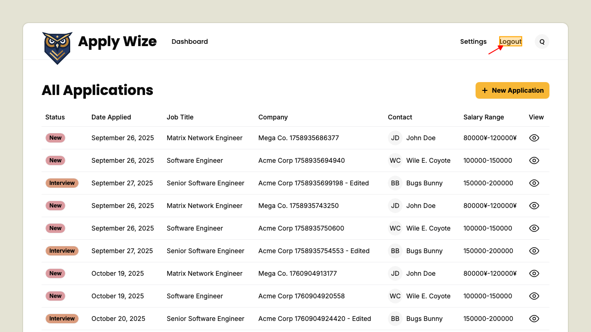
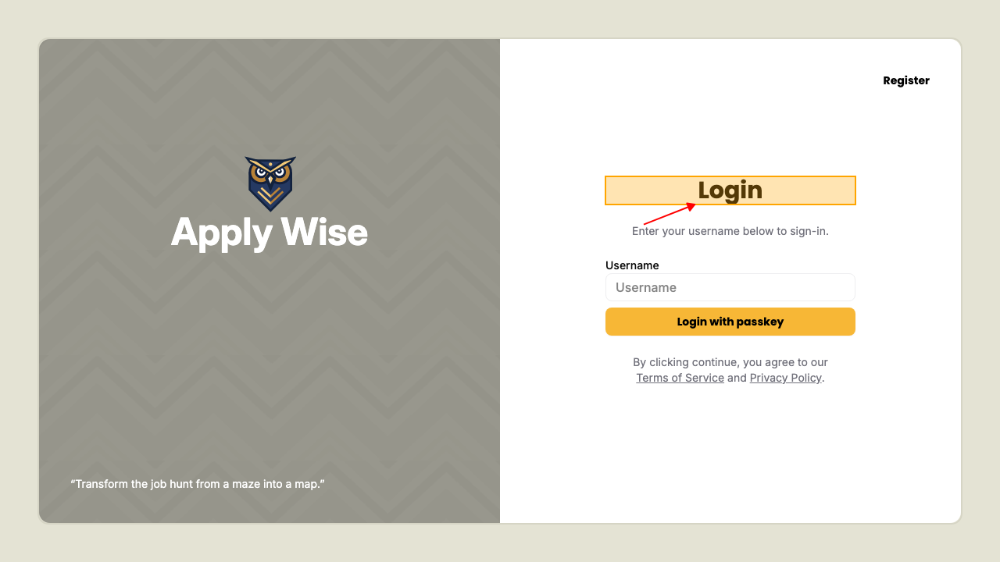

# How to logout

## Logging out

While on the applications page.
Click on logout button.

Now you should be logged out and on the login page.

To confirm that you are logged out if you try to go back to the applications page (/applications) it will redirect to login.

