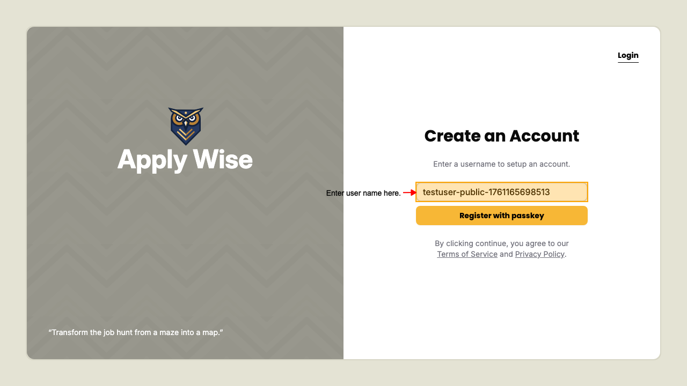
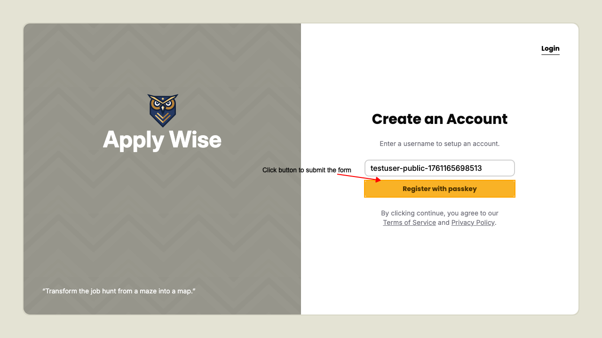
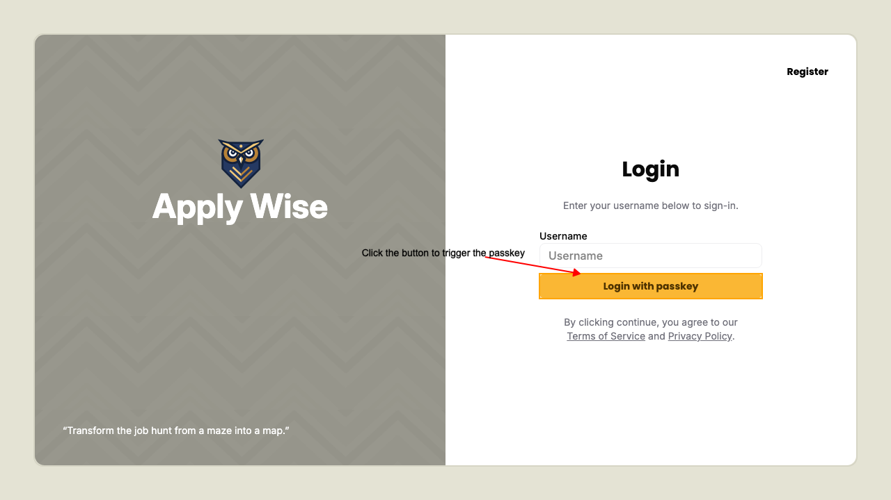

# Authentication

## Register a new user

On the sign up page, `/user/signup`.

Fill in the sign up form with the username you wish to use.

Submit the sign up form to initiate passkey registration.

On the login page, you can login with the generated new passkey

## Login with an existing user

On the login page, `/user/login`.

Click the submit button.

On successful login you'll be redirected to the protected page

