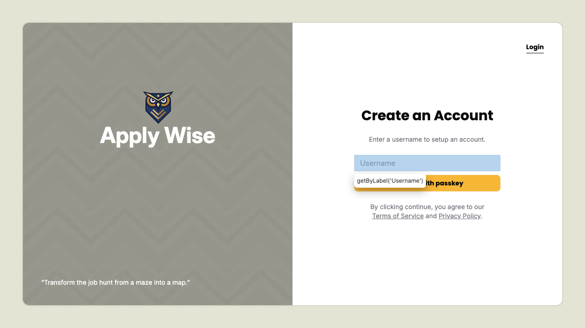

# Authentication

## Register a new user

On the sign up page

Fill in the sign up form and submit

On the login page should be able to log in with new passkey

## Login with an existing user

On the login page

Enter username in to the login form

Click submit button

On successful login you'll be redirected to the protected page

